# ĐẶC TẢ HỆ THỐNG RAG CHATBOT

## Mục lục
1. [Mô tả hệ thống](#1-mô-tả-hệ-thống)
2. [Lý thuyết công nghệ](#2-lý-thuyết-công-nghệ)
3. [Thiết kế chức năng](#3-thiết-kế-chức-năng)
4. [Thiết kế lớp](#4-thiết-kế-lớp)
5. [Đặc tả luồng hoạt động](#5-đặc-tả-luồng-hoạt-động)

---

## 1. Mô tả hệ thống

### 1.1 Tổng quan

Hệ thống RAG Chatbot là một ứng dụng trí tuệ nhân tạo kết hợp giữa **Large Language Model (LLM)** và **Retrieval-Augmented Generation (RAG)** để hỗ trợ người dùng tra cứu và tương tác với nội dung tài liệu.

### 1.2 Mục tiêu

- Cho phép người dùng upload và xử lý tài liệu (PDF, DOCX)
- Tự động tóm tắt nội dung tài liệu
- Trả lời câu hỏi dựa trên nội dung tài liệu đã upload
- Cung cấp phản hồi theo thời gian thực (streaming)
- Hỗ trợ hủy bỏ yêu cầu đang xử lý

### 1.3 Kiến trúc tổng quan

```
┌─────────────────────────────────────────────────────────────────┐
│                         CLIENT (Browser)                        │
│                    HTML/CSS/JavaScript + SSE                    │
└─────────────────────────────────────────────────────────────────┘
                                │
                                ▼
┌─────────────────────────────────────────────────────────────────┐
│                      API LAYER (FastAPI)                        │
│              REST Endpoints + Server-Sent Events                │
└─────────────────────────────────────────────────────────────────┘
                                │
        ┌───────────────────────┼───────────────────────┐
        ▼                       ▼                       ▼
┌───────────────┐      ┌───────────────┐      ┌───────────────┐
│ ChatService   │      │ FileProcessor │      │HybridRetriever│
│ (Orchestrator)│      │  (Docling)    │      │ (BM25+Semantic│
└───────────────┘      └───────────────┘      │  +Reranker)   │
        │                       │              └───────────────┘
        ▼                       ▼                       │
┌───────────────┐      ┌───────────────┐               │
│SemanticAnalyzer│     │   LLMService  │◄──────────────┘
│ (Query Intent) │     │  (Generation) │
└───────────────┘      └───────────────┘
        │                       │
        └───────────┬───────────┘
                    ▼
           ┌───────────────┐
           │    Corpus     │
           │ (Data Storage)│
           └───────────────┘
```

### 1.4 Công nghệ sử dụng

| Thành phần | Công nghệ |
|------------|-----------|
| Backend Framework | FastAPI |
| LLM Runtime | llama-cpp-python (GPU) |
| Document Processing | Docling |
| Embedding Model | bge-m3 (GGUF) |
| Reranker Model | bge-reranker-v2-m3 (GGUF) |
| LLM Model | Ministral-3B / Qwen3VL-4B |
| Full-text Search | BM25 (rank-bm25) |
| Frontend | HTML + JavaScript + SSE |

---

## 2. Lý thuyết công nghệ

### 2.1 Large Language Model (LLM)

#### 2.1.1 Khái niệm

Large Language Model (LLM) là mô hình ngôn ngữ quy mô lớn được huấn luyện trên lượng văn bản khổng lồ, có khả năng:
- Hiểu và sinh văn bản tự nhiên
- Tóm tắt nội dung
- Trả lời câu hỏi
- Phân loại ý định

#### 2.1.2 Kiến trúc Transformer

```plantuml
@startuml
skinparam rectangle {
    BackgroundColor<<input>> LightBlue
    BackgroundColor<<attention>> LightGreen
    BackgroundColor<<ffn>> LightYellow
    BackgroundColor<<output>> LightPink
}

rectangle "Input Embedding" as input <<input>>
rectangle "Positional Encoding" as pos <<input>>

rectangle "Multi-Head\nSelf-Attention" as attn <<attention>>
rectangle "Add & Norm" as norm1 <<attention>>

rectangle "Feed-Forward\nNetwork" as ffn <<ffn>>
rectangle "Add & Norm" as norm2 <<ffn>>

rectangle "Output Linear" as output <<output>>
rectangle "Softmax" as softmax <<output>>

input --> pos
pos --> attn
attn --> norm1
norm1 --> ffn
ffn --> norm2
norm2 --> output
output --> softmax

note right of attn
  Q, K, V = Linear(X)
  Attention(Q,K,V) = 
    softmax(QK^T/√d_k)V
end note

@enduml
```

#### 2.1.3 GGUF Format

Hệ thống sử dụng định dạng GGUF (GPT-Generated Unified Format) với các đặc điểm:
- **Quantization**: Nén mô hình (Q4_K_M, Q6_K, Q8_0) giảm VRAM
- **GPU Offloading**: Đẩy layers lên GPU để tăng tốc
- **Flash Attention**: Tối ưu bộ nhớ attention
- **KV Cache Quantization**: Nén key-value cache

### 2.2 Embedding Model

#### 2.2.1 Khái niệm

Embedding model chuyển đổi văn bản thành vector số học trong không gian đa chiều, cho phép:
- Đo độ tương đồng ngữ nghĩa giữa các văn bản
- Tìm kiếm semantic (theo ý nghĩa)
- Clustering và phân loại văn bản

#### 2.2.2 BGE-M3 Model

Hệ thống sử dụng **BGE-M3** (BAAI General Embedding - Multi-Functionality, Multi-Linguality, Multi-Granularity):
- **Multi-Linguality**: Hỗ trợ 100+ ngôn ngữ bao gồm tiếng Việt
- **Multi-Granularity**: Xử lý từ câu ngắn đến đoạn văn dài (8192 tokens)
- **Multi-Functionality**: Dense + Sparse + ColBERT retrieval

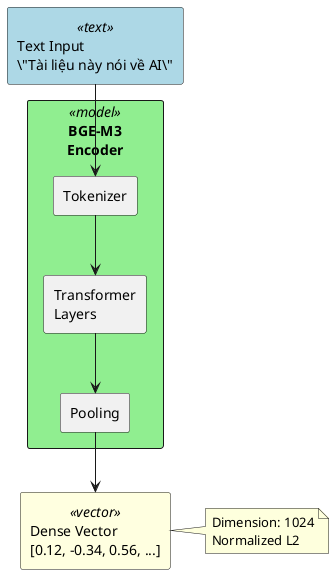

### 2.3 Reranker (Cross-Encoder)

#### 2.3.1 Khái niệm

Reranker là mô hình cross-encoder đánh giá mức độ liên quan giữa query và document bằng cách xử lý cả hai cùng lúc.

#### 2.3.2 So sánh Bi-Encoder vs Cross-Encoder

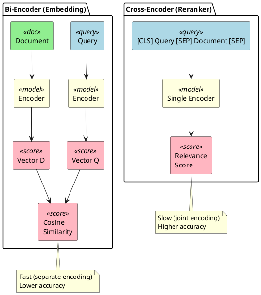

#### 2.3.3 BGE-Reranker-v2-M3

Hệ thống sử dụng **bge-reranker-v2-m3**:
- Multilingual (hỗ trợ tiếng Việt)
- Lightweight (568M parameters)
- High accuracy trên MTEB benchmark

### 2.4 Hybrid Search

#### 2.4.1 Tổng quan

Hybrid Search kết hợp nhiều phương pháp tìm kiếm để tận dụng ưu điểm của từng phương pháp:

| Phương pháp | Ưu điểm | Nhược điểm |
|-------------|---------|------------|
| **BM25** | Exact match, keyword precision | Không hiểu ngữ nghĩa |
| **Semantic** | Hiểu ngữ nghĩa, synonym | Miss exact keywords |
| **Hybrid** | Kết hợp cả hai | Phức tạp hơn |

#### 2.4.2 BM25 (Best Matching 25)

BM25 là thuật toán ranking dựa trên TF-IDF cải tiến:

$$
\text{BM25}(D, Q) = \sum_{i=1}^{n} \text{IDF}(q_i) \cdot \frac{f(q_i, D) \cdot (k_1 + 1)}{f(q_i, D) + k_1 \cdot (1 - b + b \cdot \frac{|D|}{\text{avgdl}})}
$$

Trong đó:
- $f(q_i, D)$: Tần suất term $q_i$ trong document $D$
- $|D|$: Độ dài document
- $\text{avgdl}$: Độ dài trung bình các document
- $k_1 = 1.5$, $b = 0.75$: Hyperparameters

```plantuml
@startuml
skinparam rectangle {
    BackgroundColor<<input>> LightBlue
    BackgroundColor<<process>> LightGreen
    BackgroundColor<<output>> LightYellow
}

rectangle "Query\n\"mục tiêu của dự án\"" as query <<input>>
rectangle "Corpus Documents" as corpus <<input>>

rectangle "Tokenization\n& Preprocessing" as token <<process>>
rectangle "TF Calculation" as tf <<process>>
rectangle "IDF Calculation" as idf <<process>>
rectangle "BM25 Scoring" as bm25 <<process>>

rectangle "Ranked Results\n(by BM25 score)" as output <<output>>

query --> token
corpus --> token
token --> tf
token --> idf
tf --> bm25
idf --> bm25
bm25 --> output

@enduml
```

#### 2.4.3 Semantic Search

Tìm kiếm dựa trên độ tương đồng vector embedding:

$$
\text{similarity}(Q, D) = \frac{E_Q \cdot E_D}{||E_Q|| \cdot ||E_D||}
$$

Trong đó $E_Q$, $E_D$ là embedding vectors của query và document.

```plantuml
@startuml
skinparam rectangle {
    BackgroundColor<<input>> LightBlue
    BackgroundColor<<embed>> LightGreen
    BackgroundColor<<search>> LightYellow
    BackgroundColor<<output>> LightPink
}

rectangle "Query" as query <<input>>
rectangle "Corpus Chunks" as corpus <<input>>

rectangle "Embedding\nModel" as embed <<embed>>
rectangle "Query Vector" as qvec <<embed>>
rectangle "Corpus Vectors\n(Pre-computed)" as cvec <<embed>>

rectangle "Cosine\nSimilarity" as cos <<search>>
rectangle "Top-K\nSelection" as topk <<search>>

rectangle "Semantic\nResults" as output <<output>>

query --> embed
embed --> qvec
corpus --> embed
embed --> cvec

qvec --> cos
cvec --> cos
cos --> topk
topk --> output

@enduml
```

#### 2.4.4 Reciprocal Rank Fusion (RRF)

RRF kết hợp rankings từ nhiều nguồn bằng công thức:

$$
\text{RRF}(d) = \sum_{r \in R} \frac{1}{\alpha + r(d)}
$$

Trong đó:
- $R$: Tập các rankings (BM25, Semantic)
- $r(d)$: Rank của document $d$ trong ranking $r$
- $\alpha = 60$: Smoothing constant

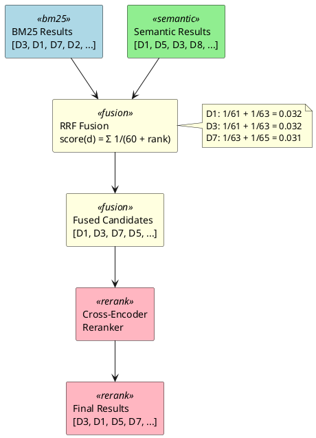

#### 2.4.5 Pipeline Hybrid Search hoàn chỉnh

```plantuml
@startuml
skinparam rectangle {
    BackgroundColor<<input>> #E3F2FD
    BackgroundColor<<bm25>> #E8F5E9
    BackgroundColor<<semantic>> #FFF3E0
    BackgroundColor<<fusion>> #F3E5F5
    BackgroundColor<<rerank>> #FFEBEE
    BackgroundColor<<output>> #E0F7FA
}

rectangle "User Query" as query <<input>>

rectangle "BM25 Retriever\n(CPU)" as bm25 <<bm25>> {
    rectangle "Tokenize" as tok1
    rectangle "TF-IDF Score" as tfidf
    rectangle "Top-K×4" as topk1
}

rectangle "Semantic Retriever\n(GPU)" as semantic <<semantic>> {
    rectangle "Embed Query" as embed
    rectangle "Cosine Similarity" as cos
    rectangle "Top-K×4" as topk2
}

rectangle "RRF Fusion" as fusion <<fusion>>

rectangle "Cross-Encoder\nReranker (GPU)" as rerank <<rerank>>

rectangle "Top-K Results" as output <<output>>

query --> bm25
query --> semantic

tok1 --> tfidf
tfidf --> topk1

embed --> cos
cos --> topk2

topk1 --> fusion
topk2 --> fusion

fusion --> rerank
rerank --> output

note bottom of output
  K = 5 (configurable)
  Final ranked chunks
  with relevance scores
end note

@enduml
```

### 2.5 Retrieval-Augmented Generation (RAG)

#### 2.5.1 Khái niệm

RAG kết hợp retrieval (tìm kiếm) với generation (sinh văn bản) để:
- Giảm hallucination của LLM
- Cung cấp thông tin cập nhật (không cần retrain)
- Trả lời dựa trên nguồn đáng tin cậy

#### 2.5.2 RAG Pipeline trong hệ thống

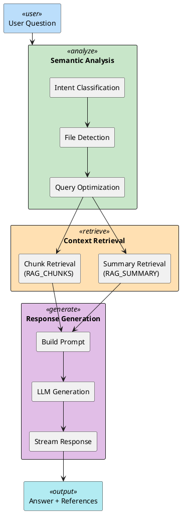

---

## 3. Thiết kế chức năng

### 3.1 Sơ đồ DFD Mức 0 (Context Diagram)

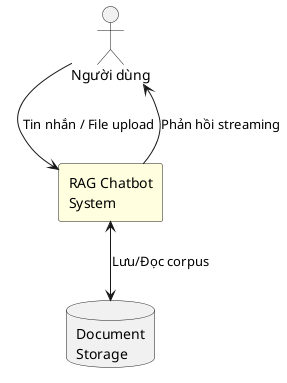

### 3.2 Sơ đồ DFD Mức 1

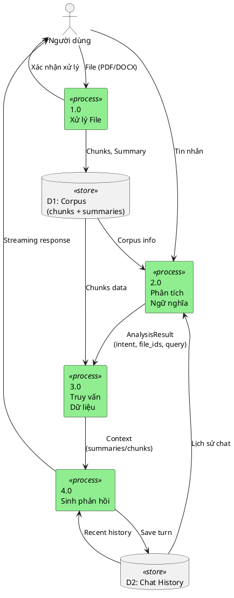

### 3.3 Đặc tả chức năng theo Module

#### 3.3.1 Module Xử lý File (FileProcessor)

| Thuộc tính | Mô tả |
|------------|-------|
| **Chức năng** | Chuyển đổi tài liệu thành chunks văn bản |
| **Input** | File PDF hoặc DOCX |
| **Output** | List[Chunk], FileSummary |
| **Công nghệ** | Docling (GPU accelerated) |

**Quy trình:**
1. Nhận file upload từ API
2. Load Docling models (on-demand)
3. Convert document → Docling Document
4. Chunk với HybridChunker (max 512 tokens)
5. Gọi LLM tóm tắt nội dung
6. Trả về chunks + summary

#### 3.3.2 Module Phân tích Ngữ nghĩa (SemanticAnalyzer)

| Thuộc tính | Mô tả |
|------------|-------|
| **Chức năng** | Phân loại ý định và xác định chiến lược truy vấn |
| **Input** | User message, Chat history, Corpus |
| **Output** | AnalysisResult (intent, file_ids, search_query) |
| **Công nghệ** | LLM-based classification |

**Các loại Intent:**

| Intent | Mô tả | Hành động |
|--------|-------|-----------|
| NO_RAG | Chat thông thường | Không truy vấn |
| ACKNOWLEDGE | Thông báo upload file | Xác nhận |
| RAG_SUMMARY | Yêu cầu tóm tắt | Lấy summaries |
| RAG_CHUNKS | Tìm kiếm chi tiết | Hybrid search |

#### 3.3.3 Module Truy vấn Dữ liệu (HybridRetriever)

| Thuộc tính | Mô tả |
|------------|-------|
| **Chức năng** | Tìm kiếm chunks liên quan đến query |
| **Input** | Query, Corpus, File filter |
| **Output** | Top-K relevant chunks |
| **Công nghệ** | BM25 + Semantic + RRF + Reranker |

**Pipeline:**
1. BM25 retrieval → Top K×4 candidates
2. Semantic retrieval → Top K×4 candidates
3. RRF fusion → Combined ranking
4. Reranker → Final Top K

#### 3.3.4 Module Sinh phản hồi (ChatService)

| Thuộc tính | Mô tả |
|------------|-------|
| **Chức năng** | Điều phối toàn bộ pipeline và sinh phản hồi |
| **Input** | User message, Optional file |
| **Output** | Streaming response |
| **Công nghệ** | LLM streaming generation |

#### 3.3.5 Module Quản lý Dữ liệu (Corpus)

| Thuộc tính | Mô tả |
|------------|-------|
| **Chức năng** | Lưu trữ và quản lý document data |
| **Cấu trúc** | chunks: List[Chunk], summaries: List[FileSummary] |
| **Persistence** | JSON file |

### 3.4 Cơ sở dữ liệu

#### 3.4.1 Corpus (documents_index.json)

```json
{
  "chunks": [
    {
      "file_id": "abc123",
      "file_name": "document.pdf",
      "chunk_index": 0,
      "meta": {"dl_meta": {...}},
      "text": "Nội dung chunk..."
    }
  ],
  "summaries": [
    {
      "file_id": "abc123",
      "file_name": "document.pdf",
      "summary": "Tóm tắt nội dung...",
      "chunk_count": 47
    }
  ]
}
```

#### 3.4.2 Chat History (chat_history.json)

```json
{
  "messages": [
    {
      "role": "system",
      "content": "System prompt..."
    },
    {
      "role": "user", 
      "content": "Câu hỏi..."
    },
    {
      "role": "assistant",
      "content": "Phản hồi...",
      "rag_context": {
        "intent": "rag_chunks",
        "reasoning": "...",
        "search_query": "...",
        "summary_file_ids": [],
        "chunk_file_ids": ["abc123"],
        "chunks_retrieved": 5,
        "chunk_refs": [{"chunk_id": "...", "file_id": "...", "rank": 1}]
      }
    }
  ]
}
```

---

## 4. Thiết kế lớp

### 4.1 Đặc tả các Class chính

#### 4.1.1 LLMService

**Chức năng:** Quản lý LLM model và sinh văn bản

| Thuộc tính | Kiểu | Mô tả |
|------------|------|-------|
| `_model_path` | `str` | Đường dẫn file GGUF |
| `_llm` | `Llama` | Instance llama-cpp |
| `_executor` | `ThreadPoolExecutor` | Thread pool cho async |
| `_lock` | `asyncio.Lock` | Đồng bộ hóa |

| Phương thức | Mô tả |
|-------------|-------|
| `load_model()` | Load model vào VRAM |
| `generate_stream()` | Sinh văn bản streaming (async) |
| `generate_complete()` | Sinh văn bản đầy đủ (async) |
| `summarize_chunks()` | Tóm tắt document |
| `unload_model()` | Giải phóng VRAM |

#### 4.1.2 SemanticAnalyzer

**Chức năng:** Phân tích ngữ nghĩa query bằng LLM

| Thuộc tính | Kiểu | Mô tả |
|------------|------|-------|
| `_llm` | `LLMService` | LLM service reference |
| `_lock` | `asyncio.Lock` | Đồng bộ hóa |
| `SYSTEM_PROMPT` | `str` | Prompt hướng dẫn phân tích |

| Phương thức | Mô tả |
|-------------|-------|
| `analyze()` | Phân tích query, trả về AnalysisResult |
| `_build_corpus_section()` | Xây dựng context corpus |
| `_build_history_section()` | Xây dựng context history |
| `_parse_llm_response()` | Parse JSON response từ LLM |

#### 4.1.3 HybridRetriever

**Chức năng:** Orchestrator cho hybrid search pipeline

| Thuộc tính | Kiểu | Mô tả |
|------------|------|-------|
| `_bm25` | `BM25Retriever` | BM25 search |
| `_semantic` | `SemanticRetriever` | Semantic search |
| `_reranker` | `Reranker` | Cross-encoder reranker |
| `_fusion` | `RRFFusion` | Rank fusion |
| `_corpus` | `Corpus` | Reference to corpus |

| Phương thức | Mô tả |
|-------------|-------|
| `process()` | Index corpus cho retrieval |
| `retrieve()` | Thực hiện hybrid search |
| `is_ready()` | Kiểm tra đã index chưa |
| `release_models()` | Giải phóng VRAM |
| `clear()` | Xóa index (giữ models) |

#### 4.1.4 FileProcessor

**Chức năng:** Xử lý tài liệu với Docling

| Thuộc tính | Kiểu | Mô tả |
|------------|------|-------|
| `_converter` | `DocumentConverter` | Docling converter |
| `_chunker` | `HybridChunker` | Text chunker |
| `_models_loaded` | `bool` | Trạng thái load |
| `_cancel_event` | `threading.Event` | Cancellation event |

| Phương thức | Mô tả |
|-------------|-------|
| `load_models()` | Load Docling models |
| `process()` | Xử lý file, trả về chunks |
| `release_models()` | Giải phóng VRAM |

#### 4.1.5 ChatService

**Chức năng:** Điều phối toàn bộ RAG pipeline

| Thuộc tính | Kiểu | Mô tả |
|------------|------|-------|
| `_llm` | `LLMService` | LLM service |
| `_retriever` | `HybridRetriever` | Retrieval service |
| `_analyzer` | `SemanticAnalyzer` | Query analyzer |
| `_corpus` | `Corpus` | Document corpus |
| `_history` | `ChatHistory` | Chat history |

| Phương thức | Mô tả |
|-------------|-------|
| `process_message()` | Xử lý tin nhắn (main pipeline) |
| `get_history()` | Lấy lịch sử chat |
| `clear_history()` | Xóa lịch sử |
| `build_user_message_with_file()` | Tạo message có file tag |

#### 4.1.6 Corpus

**Chức năng:** Quản lý và lưu trữ document data

| Thuộc tính | Kiểu | Mô tả |
|------------|------|-------|
| `chunks` | `list[Chunk]` | Tất cả chunks |
| `summaries` | `list[FileSummary]` | Tất cả summaries |

| Phương thức | Mô tả |
|-------------|-------|
| `add_chunk()` | Thêm chunk |
| `add_summary()` | Thêm summary |
| `get_chunks_by_file()` | Lấy chunks theo file |
| `get_file_ids()` | Lấy danh sách file IDs |
| `remove_file()` | Xóa file |
| `save()` / `load()` | Persistence |

### 4.2 Classes phụ trợ (Data Classes)

| Class | Chức năng |
|-------|-----------|
| `Chunk` | Đại diện một đoạn văn bản từ document |
| `FileSummary` | Tóm tắt thông tin của một file |
| `AnalysisResult` | Kết quả phân tích ngữ nghĩa |
| `RAGContext` | Metadata về RAG retrieval |
| `ChatMessage` | Một tin nhắn trong lịch sử |
| `CancellationToken` | Token hủy bỏ request |
| `QueryIntent` | Enum các loại intent |
| `ProcessingPhase` | Enum các phase xử lý |

### 4.3 Sơ đồ lớp (Class Diagram)

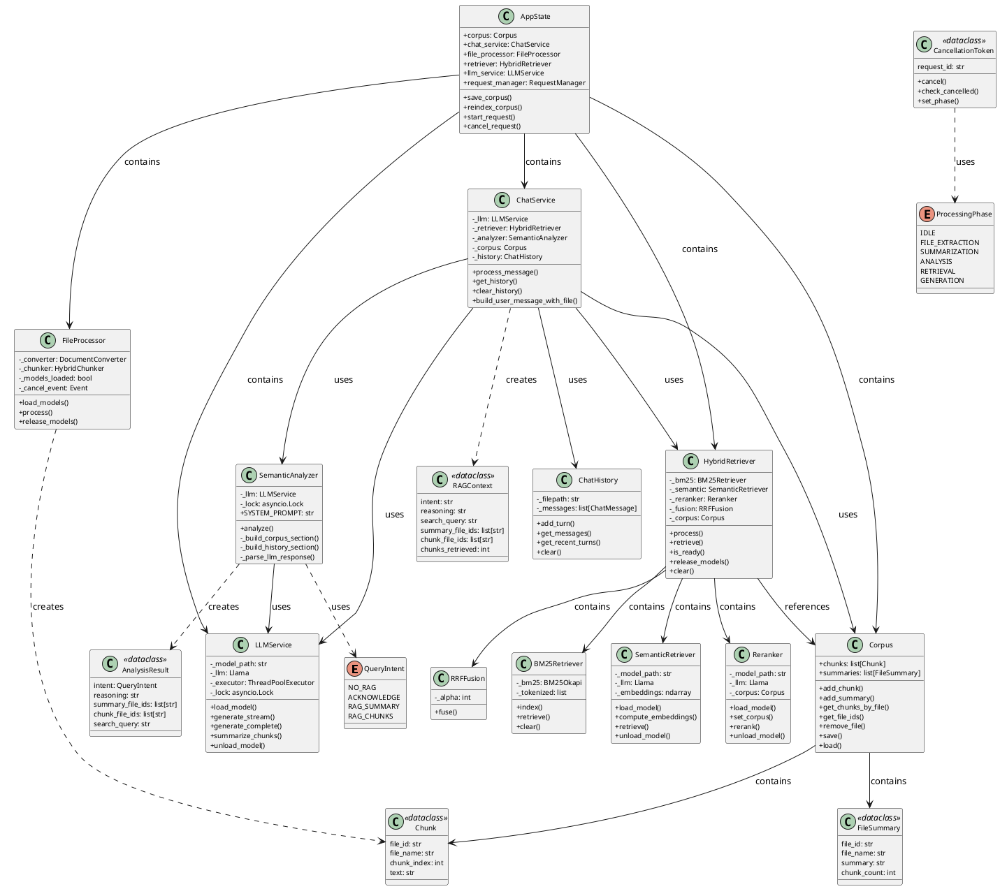

---

## 5. Đặc tả luồng hoạt động

### 5.1 Luồng 1: Người dùng gửi tin nhắn (không kèm file)

**Mô tả:** Người dùng nhập tin nhắn văn bản và nhận phản hồi streaming.

**Các bước:**
1. Người dùng nhập tin nhắn và gửi
2. API nhận request, tạo CancellationToken
3. ChatService.process_message() được gọi
4. SemanticAnalyzer phân tích ý định query
5. Dựa vào intent, thực hiện retrieval (nếu cần)
6. LLMService sinh phản hồi streaming
7. Response được stream về client qua SSE
8. Lưu turn vào ChatHistory

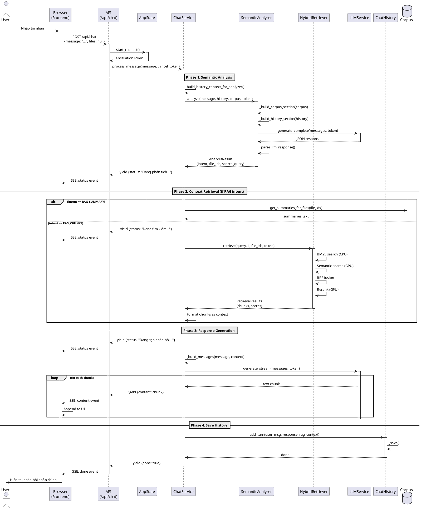

### 5.2 Luồng 2: Người dùng gửi tin nhắn kèm file

**Mô tả:** Người dùng upload file và gửi tin nhắn, hệ thống xử lý file trước rồi trả lời.

**Các bước:**
1. Người dùng chọn file và nhập tin nhắn
2. API nhận request với file
3. FileProcessor xử lý file (extract + chunk)
4. LLMService tóm tắt nội dung
5. Cập nhật Corpus và reindex
6. Tiếp tục xử lý tin nhắn như Luồng 1

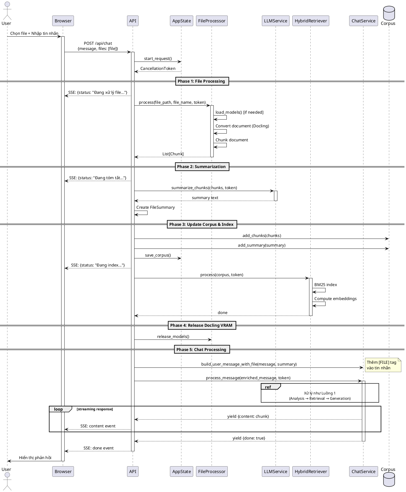

### 5.3 Luồng 3: Người dùng hủy yêu cầu đang xử lý

**Mô tả:** Người dùng nhấn nút Stop để hủy bỏ xử lý đang thực hiện.

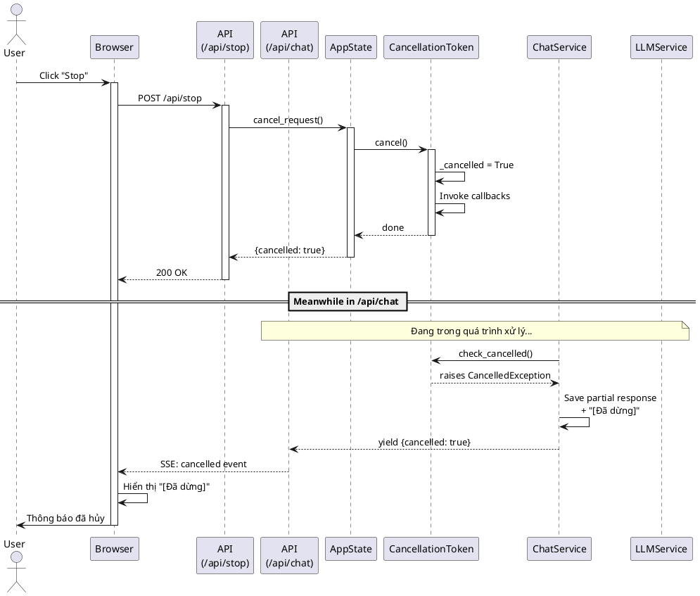

### 5.4 Luồng 4: Người dùng xóa document

**Mô tả:** Người dùng xóa một file đã upload khỏi hệ thống.

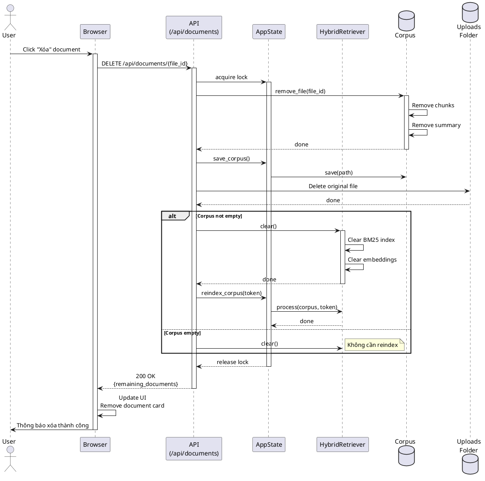

### 5.5 Luồng 5: Người dùng xóa toàn bộ dữ liệu

**Mô tả:** Người dùng reset hệ thống, xóa tất cả chat history và documents.

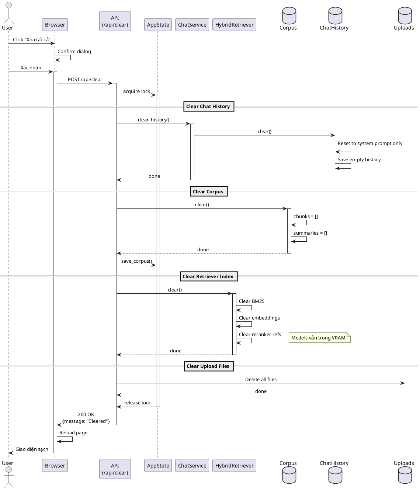

---

## Phụ lục

### A. Cấu trúc thư mục Project

```
chatbot/
├── main.py                 # Entry point
├── pyproject.toml          # Dependencies
├── README.md
│
├── src/
│   ├── core/
│   │   ├── config.py       # Configuration
│   │   ├── models.py       # Data models (Chunk, Corpus, FileSummary)
│   │   └── cancellation.py # Cancellation infrastructure
│   │
│   └── services/
│       ├── llm.py              # LLM service
│       ├── retrieval.py        # Hybrid retrieval
│       ├── semantic_analyzer.py # Query analysis
│       ├── file_processor.py   # Document processing
│       └── chat.py             # Chat orchestration
│
├── api/
│   └── routes.py           # FastAPI endpoints
│
├── models/                 # GGUF model files
│   ├── Ministral-3B-*.gguf
│   ├── bge-m3-*.gguf
│   └── bge-reranker-*.gguf
│
├── document_store/
│   └── documents_index.json # Corpus persistence
│
├── history/
│   └── chat_history.json   # Chat persistence
│
├── uploads/                # Uploaded files
│
├── static/                 # Frontend assets
│   ├── script.js
│   └── style.css
│
└── templates/
    └── index.html          # Main UI
```

### B. API Endpoints

| Method | Endpoint | Mô tả |
|--------|----------|-------|
| `POST` | `/api/chat` | Chat với optional file upload (SSE) |
| `POST` | `/api/stop` | Hủy request đang xử lý |
| `GET` | `/api/history` | Lấy lịch sử chat |
| `POST` | `/api/clear` | Xóa tất cả dữ liệu |
| `GET` | `/api/documents` | Liệt kê documents |
| `DELETE` | `/api/documents/{id}` | Xóa document |
| `GET` | `/api/documents/{id}/download` | Tải file gốc |

### C. Cấu hình hệ thống

| Tham số | Giá trị | Mô tả |
|---------|---------|-------|
| `n_ctx` | 12288 | Context length (tokens) |
| `n_batch` | 3072 | Batch size |
| `chunk_max_tokens` | 512 | Max tokens per chunk |
| `retrieval_top_k` | 5 | Số chunks trả về |
| `rrf_alpha` | 60 | RRF smoothing constant |
| `n_gpu_layers` | -1 | Full GPU offload |
